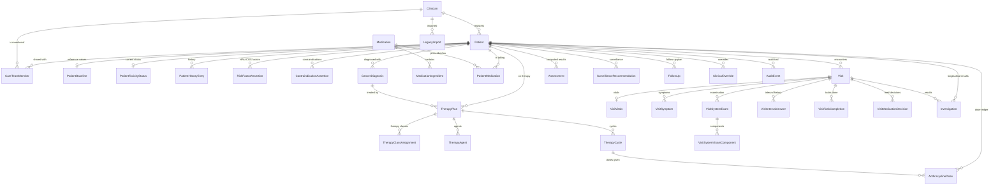

# CORSC database

PostgreSQL, accessed through Prisma. The schema is
[`prisma/schema.prisma`](../prisma/schema.prisma); the migrations are in
[`prisma/migrations`](../prisma/migrations).

---

## 1. Principles

1. **No clinical rule lives in the database.** There is no threshold, no
   conversion factor, no proforma weight and no guideline text in any table.
   Those live in versioned application code, so a clinical rule change is a
   reviewed code change rather than a row update. What *is* stored is the engine
   and rules version that produced each computed result.

2. **Clinical facts are columns.** A patient record is spread across normalised
   tables so that "every LVEF this patient has ever had" is a query rather than a
   scan of serialised objects — and so that the database can refuse a value that
   cannot be true.

3. **Baseline risk and current toxicity are separate tables.** A troponin rise
   after cycle 4 must never rewrite what the risk was before therapy started.

4. **Nothing clinical is deleted.** Patients are archived, medications are
   stopped, overrides are withdrawn, surveillance is superseded, audit rows
   cannot be changed at all.

### Where JSON is used, and why

Three places, each deliberate:

| Column | Why JSON is right here |
|---|---|
| `assessments.result` / `.inputs` | The engine's own return value. It differs per engine, is written once and read back verbatim. Promoting it to columns would freeze one engine's output shape into the schema and force a migration whenever an engine gained a field. |
| `investigations.measurements` | ECG intervals as entered. Which intervals get recorded varies by machine and by what the reporter measured, and no engine queries across them. |

Everything else that could have been JSON — history, risk factors,
contraindications, medications, vitals, symptoms, examination, interval history —
is rows.

## 2. The model



### Tables

| Table | Holds |
|---|---|
| `clinicians` | Service-facing profile. `id` is the Supabase auth user id; `role` is the authorisation. |
| `care_team_members` | Explicit shared access to a patient, grantable and revocable. |
| `patients` | The central record. Archived, never deleted. |
| `patient_baselines` | The reference values every later measurement is compared against, including the troponin assay. |
| `patient_toxicity_status` | Clinician-asserted current status — the *other* axis from baseline risk. |
| `patient_history_entries` | One row per answered history item. |
| `risk_factor_assertions` | One row per recorded HFA-ICOS factor, by tier. |
| `contraindication_assertions` | Absolute and relative contraindications. |
| `cancer_diagnoses` | Site, type, histology, stage, intent. |
| `therapy_plans` | A planned course. A patient may have several. |
| `therapy_class_assignments` | The cardiotoxicity-relevant classes on a plan — **always a list**. |
| `therapy_agents` | Individual agents and planned doses. |
| `therapy_cycles` | One row per cycle, with delay and toxicity reasons. |
| `anthracycline_doses` | The dose ledger, with BSA, equivalence model, and the reason where a dose could not be converted. |
| `medications` | The formulary. Reference data, not patient data. |
| `medication_ingredients` | Active ingredients of each product. |
| `patient_medications` | What a patient is on, with the four prescription slots. |
| `visits` | Encounters, including the in-progress draft. |
| `visit_vitals`, `visit_symptoms`, `visit_system_exams`, `visit_system_exam_components`, `visit_interval_answers`, `visit_task_completions`, `visit_medication_decisions` | Structured encounter content. |
| `investigations` | Every result, cardiac or otherwise, with assay provenance where relevant. |
| `assessments` | What an engine produced, with its version. Never updated. |
| `surveillance_recommendations` | What is due, when, why, and on whose authority. |
| `follow_ups` | Planned reviews with acuity and every contributing trigger. |
| `clinical_overrides` | Additive clinician overrides. Withdrawn, never edited. |
| `audit_events` | Append-only trail. |
| `legacy_imports` | One row per record offered to the browser-storage migration. |

### One table for investigations, not two

An LVEF recorded as "an investigation" and the same LVEF recorded as "a cardiac
measurement" would be two versions of one fact, free to disagree — and a report
reading one while surveillance read the other would be worse than having
neither. So there is one `investigations` table, with nullable cardiac-specific
columns (`assay_id`, `reference_upper_limit`, `laboratory`, `measurements`), and
`GET /api/patients/:id/cardiac-measurements` is a query over the cardiac subset.

### Why baselines are columns, not derived

`patient_baselines` holds the reference values as first-class columns rather than
deriving "the baseline" from whichever investigation row looks earliest. The
engines read them directly, and a service that re-derived the baseline would
silently re-grade every historical comparison whenever a row was added or
corrected.

### Troponin assay provenance

Troponin results from different high-sensitivity assays are **not comparable**
and have different reference limits. The assay identifier and the limit that was
actually applied are stored beside the value, in both `patient_baselines` and
`investigations`. Nothing in CORSC compares a troponin against a universal
threshold, and this schema is what makes that possible to honour years later,
after the laboratory has changed platform.

## 3. Constraints

Beyond foreign keys and enums, the second migration adds range checks. These are
**not clinical rules** — they reject values that cannot be true, so a mistyped
ejection fraction of 700 is refused at entry rather than propagating into a risk
assessment.

| Constraint | Rejects |
|---|---|
| `patients_age_range` | age outside 0–130 |
| `patients_name_present` | a blank name |
| `patients_archive_consistency` | `ARCHIVED` without a date, or a date without the status |
| `baseline_lvef_range` | LVEF outside 0–100 |
| `baseline_gls_range` | GLS magnitude above 60 (either sign is accepted) |
| `baseline_qtc_range` | QTc outside 200–800 ms |
| `baseline_troponin_non_negative`, `baseline_ntprobnp_non_negative` | negative biomarkers |
| `dose_non_negative`, `dose_bsa_range`, `dose_cycle_positive` | impossible doses |
| `medication_slots_non_negative` | negative prescription slots |
| `medication_active_consistency` | a medicine both active and stopped |
| `medication_dates_ordered`, `therapy_dates_ordered` | an end before a start |
| `vitals_*_range` | impossible blood pressure, pulse, SpO₂, respiratory rate, temperature, weight, height |
| `override_reason_present` | an override with no reason |
| `surveillance_reason_present` | a recommendation with no reason |
| `assessment_engine_version_present` | an assessment with no engine version |

GLS is bounded by magnitude only, deliberately: it is reported negative by
convention, both conventions appear in echo reports, and the engines compare
absolute values.

## 4. Immutability

Two triggers, both calling `corsc_reject_mutation()`:

| Trigger | Effect |
|---|---|
| `audit_events_append_only` | `UPDATE` and `DELETE` on `audit_events` raise |
| `assessments_no_update` | `UPDATE` on `assessments` raises |

Enforced by trigger rather than by permissions alone so the guarantee holds
against the application's own privileged connection. An audit trail the
application can rewrite is not an audit trail.

**Consequence:** a patient with audit history cannot be hard-deleted, because the
cascade would have to delete audit rows. That is intended. Patients are archived.

For a development reset, `TRUNCATE` bypasses `BEFORE DELETE` triggers — which is
exactly the distinction wanted, and is what `tests/helpers/database.ts` and
`prisma/seed.ts` use.

## 5. Row-level security

Enabled and **forced** on every table before any policy exists, so tables are
closed by default and closed to the table owner too.

### Two access paths, two controls

| Path | Reaches the database as | Protected by |
|---|---|---|
| Browser → Supabase PostgREST | the signed-in user | **these policies** |
| Browser → CORSC API → Prisma | a role that bypasses RLS | `lib/backend/auth` |

The publishable key is in the client bundle by design, so the browser can reach
PostgREST directly; RLS is what stands between an authenticated user and another
clinician's caseload on that path.

The API connects with a role that bypasses RLS because it must read a clinician
profile and write an audit row for a caller who does not own the patient. **This
means every route handler must call `requirePatientAccess()`** —
`tests/api/security.test.ts` is what holds that obligation.

### Required role attributes

`DATABASE_URL` must name a role that can bypass RLS: a superuser, or a role with
`BYPASSRLS`. On Supabase the `postgres` role already qualifies. A role without
it will be denied by the forced policies and CORSC will appear to have an empty
database — a safe failure, but a confusing one.

### Policy helpers

| Function | Answers |
|---|---|
| `corsc_is_admin()` | is the caller an active admin? |
| `corsc_can_read_patient(uuid)` | owner, care-team member, or admin? |
| `corsc_can_write()` | an active role that is not `READ_ONLY` or `RESEARCHER`? |

All three are `SECURITY DEFINER` with a pinned `search_path`, so a policy can
read the clinicians table without recursing through that table's own policies.

### What has no policy

- **No `DELETE` policy on any table.** Clinical records are archived.
- **No `UPDATE` on `audit_events`, `assessments`, `clinical_overrides`,
  `surveillance_recommendations`, `follow_ups`.**
- **No client write on `medications`.** The formulary is maintained by import.
- A clinician may edit their own profile but **not their own role** — the
  `WITH CHECK` compares the role against the stored one, so self-service
  escalation is impossible.

### Running against plain PostgreSQL

The RLS migration detects the absence of `auth.users` and skips policy creation
while still enabling and forcing RLS everywhere. A CI or local database driven
exclusively through the API is unaffected; a real Supabase deployment gets the
full policy set.

## 6. Indexes

| Table | Index |
|---|---|
| `patients` | `(created_by_id, status, updated_at desc)`, `(created_by_id, hospital_patient_id)`, `name`, trigram on `name` |
| `visits` | `(patient_id, occurred_on desc)`, `(patient_id, status)`, `next_follow_up_on` |
| `investigations` | `(patient_id, investigation_id, measured_on desc)`, `(patient_id, is_baseline)` |
| `anthracycline_doses` | `(patient_id, cycle_number)`, `(patient_id, given_on)` |
| `assessments` | `(patient_id, kind, computed_at desc)` |
| `surveillance_recommendations` | `(patient_id, status, due_on)`, `(due_on, status)` |
| `audit_events` | `(patient_id, occurred_at desc)`, `(actor_id, occurred_at desc)`, `(category, occurred_at desc)` |
| `medications` | `generic_name`, `brand_name`, `medication_class`, trigram on `search_text` |
| `patient_medications` | `(patient_id, active)` |

`medications.search_text` is a lower-cased haystack of names and aliases,
maintained by the `medications_search_text` trigger. A generated column would
have been cleaner, but `array_to_string` is only `STABLE` and PostgreSQL will
not accept it in a generation expression.

The engine adapter loads a whole patient in **one query**
(`enginePatientInclude`) rather than a round trip per relation: a patient with
twenty visits would otherwise cost sixty queries to assemble.

## 7. Migrations

| Migration | Contents |
|---|---|
| `20260817000000_init` | Every table, enum, index and foreign key. |
| `20260817000100_constraints_rls_and_search` | Range checks, append-only triggers, `pg_trgm` and the search trigger, row-level security. |

Every schema change is migration-based. CI runs `prisma migrate deploy` and then
`prisma migrate diff --exit-code`, which fails if `schema.prisma` was changed
without a migration — the failure mode that works locally and breaks on
deployment.

### A note on `supabase/migrations/0001_corsc_schema.sql`

That file predates this work and describes an earlier, flatter design that was
never applied to a live database or wired into the application. It is left in
place rather than deleted, because deleting it would remove the record of what
was intended. **Prisma migrations are authoritative.** Do not apply both.

## 8. Setting up

```bash
git clone <repo> && cd CORSC
npm ci                                  # runs prisma generate
cp example.env .env.local               # then fill in DATABASE_URL and DIRECT_URL

npx prisma migrate deploy               # apply the schema
npm run db:import-formulary             # load the medication dictionary
npm run db:seed                         # synthetic development patients

npm run dev
```

| Script | Does |
|---|---|
| `npm run db:validate` | validate `schema.prisma` |
| `npm run db:migrate` | create and apply a migration in development |
| `npm run db:deploy` | apply committed migrations (deployment) |
| `npm run db:seed` | three synthetic patients — **development only** |
| `npm run db:import-formulary` | load the formulary CSVs |

### Development, test and production

`prisma/seed.ts` refuses to run when `NODE_ENV` is production or when
`DATABASE_URL` looks like a production database, and requires
`CORSC_ALLOW_SEED=yes-this-is-not-production` to be overridden. Seeding fictional
patients into a live clinical database would put invented people on a real
caseload.

CI uses an ephemeral PostgreSQL service container. Production credentials are
never available to CI.

## 9. Seed data

Three synthetic patients, chosen to exercise what is easy to get wrong:

1. **Anita Testcase** — anthracycline + HER2 combination with a dose ledger.
   Both therapy classes must survive and both proformas must run.
2. **Brian Fixture** — low baseline risk with a troponin rise and a GLS fall
   since. The baseline must still read low.
3. **Carla Sample** — checkpoint inhibitor with a troponin rise, on a *different*
   assay from Brian. The myocarditis screening pathway fires regardless of
   ejection fraction or symptoms, and the two troponin values must never be
   compared to each other.

None of these people exist. Do not add real patient data to `prisma/seed.ts`.

## 10. Backup and recovery

Not implemented by this repository, and it needs to be by whoever deploys it.

- Supabase provides point-in-time recovery on paid plans; a self-hosted database
  needs `pg_dump` on a schedule with restores actually tested.
- The migration endpoint's `commit: false` dry run and the browser-backup export
  cover the browser-storage transition only. They are not a backup strategy for
  the database.
- Because nothing clinical is deleted, most recovery scenarios are a query
  rather than a restore. That is not a substitute for backups.
